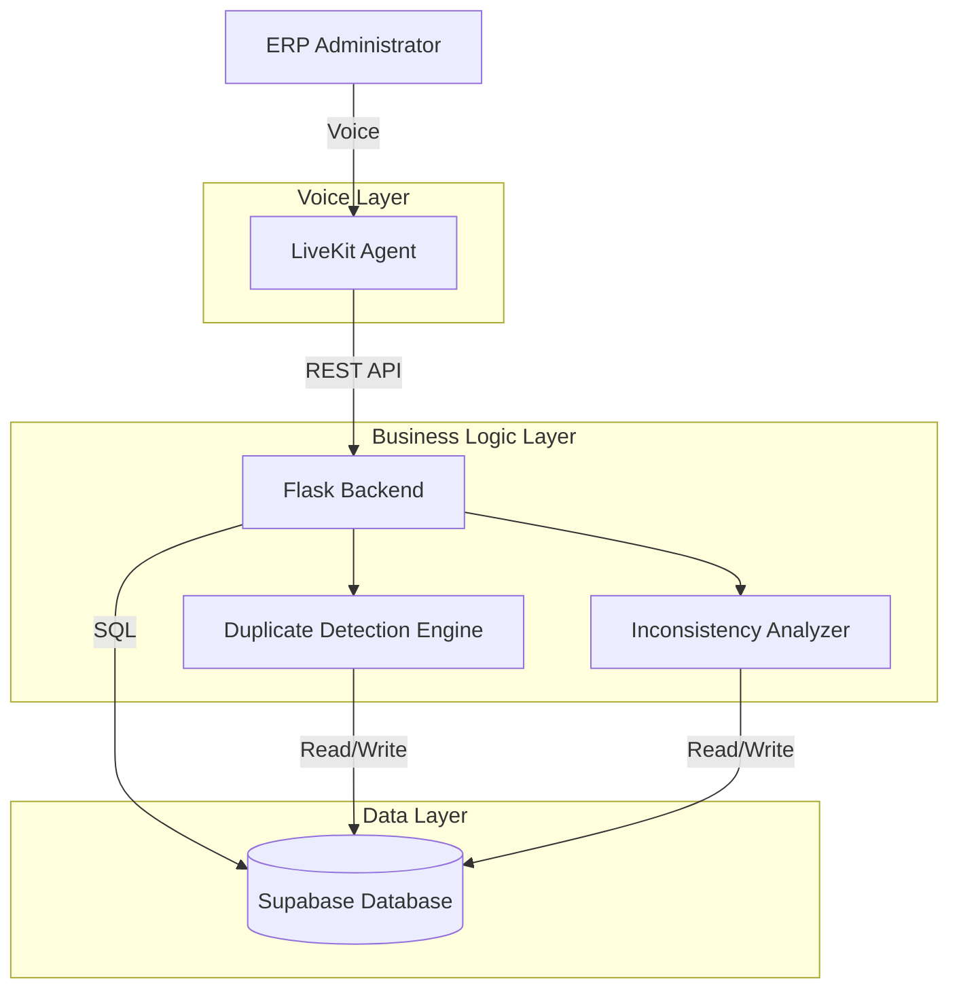

# Design Document: ERP Voice Chat System

## Overview

The ERP Voice Chat System is a prototype voice-enabled interface for Enterprise Resource Planning systems that allows administrators to query, detect, and resolve data quality issues through natural voice conversations. The system integrates three core technologies:

- **Flask**: Lightweight Python web framework providing REST APIs and business logic
- **Supabase**: PostgreSQL-based backend-as-a-service for data persistence
- **LiveKit Agents**: Real-time voice AI framework for natural language interaction

The system addresses two critical data quality challenges: duplicate records and data inconsistencies. Administrators can discover these issues and resolve them through conversational voice commands, making data maintenance more accessible and efficient.

## Architecture

### High-Level Architecture



### Layer Responsibilities

**Voice Layer (LiveKit Agent)**
- Manages real-time audio streaming and WebRTC connections
- Transcribes administrator speech to text using STT (Speech-to-Text) with Spanish language support
- Synthesizes responses to speech using TTS (Text-to-Speech) in Spanish
- Maintains conversation context and state in Spanish
- Invokes Flask Backend APIs based on voice commands in Spanish

**Business Logic Layer (Flask Backend)**
- Exposes REST APIs for data operations
- Authenticates and authorizes requests
- Orchestrates duplicate detection and inconsistency analysis
- Validates data modifications before persistence
- Implements business rules for merge operations

**Data Layer (Supabase)**
- Stores ERP data (customers, products, orders, etc.)
- Stores duplicate detection results and similarity scores
- Stores inconsistency analysis results
- Provides PostgreSQL database with real-time capabilities
- Handles data persistence and retrieval

### Technology Stack

- **Python 3.11+**: Primary programming language
- **Flask 3.x**: Web framework for REST APIs
- **LiveKit Agents SDK**: Voice AI framework
- **Supabase Python Client**: Database client library
- **PostgreSQL**: Relational database (via Supabase)
- **Whisper (OpenAI)**: Free STT model with Spanish language support
- **LiveKit Inference TTS**: TTS via LiveKit's inference service (supports multiple providers)
- **Ollama with Llama 3**: Free, local LLM for natural language understanding

## Components and Interfaces

### 1. LiveKit Voice Agent

**Purpose**: Handle real-time voice interactions with administrators

**Key Responsibilities**:
- Establish and maintain WebRTC audio connections
- Process voice input and generate voice output
- Parse administrator intent from transcribed text
- Route requests to appropriate Flask API endpoints
- Maintain conversation state across multiple turns

**Interface**:
```python
class ERPVoiceAgent:
    async def handle_voice_session(self, room: rtc.Room) -> None:
        """Main entry point for voice sessions"""
        
    async def process_query(self, text: str) -> str:
        """Process ERP data queries"""
        
    async def handle_duplicate_detection(self) -> str:
        """Trigger and report duplicate detection"""
        
    async def handle_duplicate_merge(self, duplicate_id: str) -> str:
        """Guide administrator through merge operation"""
        
    async def handle_inconsistency_detection(self) -> str:
        """Trigger and report inconsistency analysis"""
        
    async def handle_inconsistency_fix(self, inconsistency_id: str) -> str:
        """Guide administrator through fixing inconsistencies"""
```

**Tools/Functions**:
The agent will expose these as callable functions to the LLM:
- `query_erp_data(query: str)`: Query ERP database
- `detect_duplicates()`: Run duplicate detection
- `get_duplicate_details(duplicate_id: str)`: Get specific duplicate group
- `merge_duplicates(duplicate_id: str, keep_values: dict)`: Merge duplicate records
- `detect_inconsistencies()`: Run inconsistency analysis
- `get_inconsistency_details(inconsistency_id: str)`: Get specific inconsistency
- `fix_inconsistency(inconsistency_id: str, correction: dict)`: Apply correction

### 2. Flask Backend API

**Purpose**: Provide REST APIs for data operations and business logic

**Endpoints**:

```
POST /api/auth/login
- Authenticate administrator
- Returns: JWT token

GET /api/erp/query
- Query ERP data with natural language or structured filters
- Params: query (string), filters (JSON)
- Returns: List of matching records

POST /api/duplicates/detect
- Trigger duplicate detection analysis
- Returns: Job ID for async processing

GET /api/duplicates
- Get all detected duplicate groups
- Returns: List of duplicate groups with similarity scores

GET /api/duplicates/{id}
- Get specific duplicate group details
- Returns: Duplicate group with full record details

POST /api/duplicates/{id}/merge
- Merge duplicate records
- Body: { keep_values: dict, conflict_resolutions: dict }
- Returns: Merged record

POST /api/inconsistencies/detect
- Trigger inconsistency analysis
- Returns: Job ID for async processing

GET /api/inconsistencies
- Get all detected inconsistencies
- Returns: List of inconsistencies by type

GET /api/inconsistencies/{id}
- Get specific inconsistency details
- Returns: Inconsistency with affected records

POST /api/inconsistencies/{id}/fix
- Apply correction to inconsistency
- Body: { correction: dict }
- Returns: Updated records
```

**Interface**:
```python
class ERPDataService:
    def query_data(self, query: str, filters: dict) -> List[dict]:
        """Query ERP data"""
        
    def get_record(self, table: str, record_id: str) -> dict:
        """Get specific record"""
        
    def update_record(self, table: str, record_id: str, data: dict) -> dict:
        """Update record"""
        
    def delete_record(self, table: str, record_id: str) -> bool:
        """Delete record"""
```

### 3. Duplicate Detection Engine

**Purpose**: Identify duplicate records in ERP database

**Algorithm**:
1. For each table, extract records with key identifying fields
2. Compare records pairwise using fuzzy matching:
   - Exact match on IDs (100% similarity)
   - Levenshtein distance for text fields (name, email)
   - Normalized phone numbers for phone fields
3. Calculate overall similarity score (0-100)
4. Group records with similarity > threshold (default 80%)
5. Store duplicate groups in `duplicate_groups` table

**Interface**:
```python
class DuplicateDetectionEngine:
    def detect_duplicates(self, table: str, threshold: int = 80) -> List[DuplicateGroup]:
        """Detect duplicates in specified table"""
        
    def calculate_similarity(self, record1: dict, record2: dict) -> float:
        """Calculate similarity score between two records"""
        
    def get_duplicate_groups(self) -> List[DuplicateGroup]:
        """Get all detected duplicate groups"""
        
    def merge_duplicates(self, group_id: str, keep_values: dict) -> dict:
        """Merge duplicate records into canonical record"""
```

**Similarity Calculation**:
- Text fields: Levenshtein distance normalized to 0-100
- Email: Exact match or domain similarity
- Phone: Normalized format comparison
- Overall: Weighted average of field similarities

### 4. Inconsistency Analyzer

**Purpose**: Detect data inconsistencies across related records

**Inconsistency Types**:
1. **Referential**: Foreign keys pointing to non-existent records
2. **Calculation**: Computed totals not matching stored values (e.g., order total ≠ sum of line items)
3. **Format**: Data not matching expected format (e.g., invalid email, phone)
4. **Business Rule**: Violations of business constraints (e.g., negative inventory, future order dates)

**Interface**:
```python
class InconsistencyAnalyzer:
    def detect_inconsistencies(self) -> List[Inconsistency]:
        """Detect all types of inconsistencies"""
        
    def check_referential_integrity(self) -> List[Inconsistency]:
        """Check foreign key constraints"""
        
    def check_calculations(self) -> List[Inconsistency]:
        """Verify computed values match stored values"""
        
    def check_formats(self) -> List[Inconsistency]:
        """Validate data formats"""
        
    def check_business_rules(self) -> List[Inconsistency]:
        """Validate business constraints"""
        
    def fix_inconsistency(self, inconsistency_id: str, correction: dict) -> dict:
        """Apply correction to inconsistency"""
```

### 5. Data Access Layer

**Purpose**: Abstract database operations and isolate schema changes

**Interface**:
```python
class SupabaseRepository:
    def __init__(self, supabase_client):
        self.client = supabase_client
        
    def query(self, table: str, filters: dict) -> List[dict]:
        """Query table with filters"""
        
    def get_by_id(self, table: str, id: str) -> dict:
        """Get record by ID"""
        
    def insert(self, table: str, data: dict) -> dict:
        """Insert new record"""
        
    def update(self, table: str, id: str, data: dict) -> dict:
        """Update existing record"""
        
    def delete(self, table: str, id: str) -> bool:
        """Delete record"""
        
    def execute_sql(self, query: str, params: dict) -> List[dict]:
        """Execute raw SQL query"""
```

## Data Models

### ERP Tables (Example Schema)

```sql
-- Customers table
CREATE TABLE customers (
    id UUID PRIMARY KEY DEFAULT gen_random_uuid(),
    name VARCHAR(255) NOT NULL,
    email VARCHAR(255),
    phone VARCHAR(50),
    address TEXT,
    created_at TIMESTAMP DEFAULT NOW(),
    updated_at TIMESTAMP DEFAULT NOW()
);

-- Products table
CREATE TABLE products (
    id UUID PRIMARY KEY DEFAULT gen_random_uuid(),
    name VARCHAR(255) NOT NULL,
    sku VARCHAR(100) UNIQUE,
    price DECIMAL(10, 2) NOT NULL,
    inventory_count INTEGER DEFAULT 0,
    created_at TIMESTAMP DEFAULT NOW(),
    updated_at TIMESTAMP DEFAULT NOW()
);

-- Orders table
CREATE TABLE orders (
    id UUID PRIMARY KEY DEFAULT gen_random_uuid(),
    customer_id UUID REFERENCES customers(id),
    order_date TIMESTAMP NOT NULL,
    total_amount DECIMAL(10, 2) NOT NULL,
    status VARCHAR(50) DEFAULT 'pending',
    created_at TIMESTAMP DEFAULT NOW(),
    updated_at TIMESTAMP DEFAULT NOW()
);

-- Order items table
CREATE TABLE order_items (
    id UUID PRIMARY KEY DEFAULT gen_random_uuid(),
    order_id UUID REFERENCES orders(id) ON DELETE CASCADE,
    product_id UUID REFERENCES products(id),
    quantity INTEGER NOT NULL,
    unit_price DECIMAL(10, 2) NOT NULL,
    line_total DECIMAL(10, 2) NOT NULL,
    created_at TIMESTAMP DEFAULT NOW()
);
```

### Data Quality Tables

```sql
-- Duplicate groups table
CREATE TABLE duplicate_groups (
    id UUID PRIMARY KEY DEFAULT gen_random_uuid(),
    table_name VARCHAR(100) NOT NULL,
    record_ids UUID[] NOT NULL,
    similarity_score DECIMAL(5, 2) NOT NULL,
    matching_fields JSONB NOT NULL,
    status VARCHAR(50) DEFAULT 'pending',
    created_at TIMESTAMP DEFAULT NOW(),
    resolved_at TIMESTAMP
);

-- Inconsistencies table
CREATE TABLE inconsistencies (
    id UUID PRIMARY KEY DEFAULT gen_random_uuid(),
    type VARCHAR(50) NOT NULL, -- referential, calculation, format, business_rule
    table_name VARCHAR(100) NOT NULL,
    record_id UUID NOT NULL,
    field_name VARCHAR(100),
    description TEXT NOT NULL,
    suggested_fix JSONB,
    status VARCHAR(50) DEFAULT 'pending',
    created_at TIMESTAMP DEFAULT NOW(),
    resolved_at TIMESTAMP
);
```

### Python Data Models

```python
from dataclasses import dataclass
from typing import List, Optional, Dict
from datetime import datetime
from enum import Enum

@dataclass
class DuplicateGroup:
    id: str
    table_name: str
    record_ids: List[str]
    similarity_score: float
    matching_fields: Dict[str, any]
    status: str
    created_at: datetime
    resolved_at: Optional[datetime] = None

class InconsistencyType(Enum):
    REFERENTIAL = "referential"
    CALCULATION = "calculation"
    FORMAT = "format"
    BUSINESS_RULE = "business_rule"

@dataclass
class Inconsistency:
    id: str
    type: InconsistencyType
    table_name: str
    record_id: str
    field_name: Optional[str]
    description: str
    suggested_fix: Optional[Dict]
    status: str
    created_at: datetime
    resolved_at: Optional[datetime] = None

@dataclass
class ERPRecord:
    id: str
    table_name: str
    data: Dict[str, any]
    created_at: datetime
    updated_at: datetime
```


## Correctness Properties

*A property is a characteristic or behavior that should hold true across all valid executions of a system-essentially, a formal statement about what the system should do. Properties serve as the bridge between human-readable specifications and machine-verifiable correctness guarantees.*

### Property 1: Voice query processing completeness
*For any* valid voice query in Spanish about ERP data, the system should transcribe the audio, retrieve relevant data from the database, and synthesize a voice response in Spanish.
**Validates: Requirements 1.2, 1.3, 1.4**

### Property 2: Conversation context persistence
*For any* sequence of related queries in Spanish within an active voice session, the system should maintain context such that later queries can reference entities from earlier queries.
**Validates: Requirements 1.5**

### Property 3: Duplicate detection accuracy
*For any* set of ERP records containing duplicates with matching key fields, the duplicate detection engine should identify all duplicate groups.
**Validates: Requirements 2.1**

### Property 4: Similarity score bounds
*For any* pair of duplicate records, the calculated similarity score should be between 0 and 100 inclusive.
**Validates: Requirements 2.2**

### Property 5: Duplicate persistence
*For any* detected duplicate group, the group should be stored in the database with its similarity score and matching fields.
**Validates: Requirements 2.3**

### Property 6: Duplicate reporting completeness
*For any* request to report duplicates, the system should include the number of groups, matching fields, and similarity percentages for all detected duplicates.
**Validates: Requirements 2.4, 2.5**

### Property 7: Merge data preservation
*For any* merge operation on duplicate records, all non-null values from both records should appear in the resulting canonical record.
**Validates: Requirements 3.3**

### Property 8: Merge referential integrity
*For any* merge operation, all foreign key references pointing to the deleted duplicate should be updated to point to the canonical record.
**Validates: Requirements 3.4**

### Property 9: Merge conflict handling
*For any* merge operation where both records have different non-null values in the same field, the system should prompt the administrator to choose which value to keep.
**Validates: Requirements 3.5**

### Property 10: Inconsistency detection completeness
*For any* set of related ERP records with mismatches in related fields, the inconsistency analyzer should identify all mismatches.
**Validates: Requirements 4.1**

### Property 11: Inconsistency categorization
*For any* detected inconsistency, it should be categorized as one of: referential, calculation, format, or business rule violation.
**Validates: Requirements 4.2**

### Property 12: Inconsistency reporting completeness
*For any* request to report inconsistencies, the system should include the count by type, details, and plain language explanations for all detected inconsistencies.
**Validates: Requirements 4.3, 4.4**

### Property 13: Calculation inconsistency detection
*For any* record with computed totals, if the computed value does not match the stored value, the inconsistency analyzer should detect it.
**Validates: Requirements 4.5**

### Property 14: Correction verification
*For any* applied correction, re-running the inconsistency analyzer should not detect the same inconsistency (round-trip property).
**Validates: Requirements 5.4**

### Property 15: Correction referential integrity
*For any* correction that affects related records, all dependent data should be updated to maintain referential integrity.
**Validates: Requirements 5.5**

### Property 16: API authentication enforcement
*For any* API request to the Flask backend, authentication should be verified before processing the request.
**Validates: Requirements 6.1**

### Property 17: Data modification validation
*For any* data modification request, validation should occur and invalid modifications should be rejected before database updates.
**Validates: Requirements 6.5**

### Property 18: Error explanation
*For any* error that occurs during processing, the system should provide a plain language explanation in Spanish and suggest next steps.
**Validates: Requirements 7.3**

## Error Handling

### Voice Layer Errors

**Connection Failures**:
- Detect WebRTC connection drops
- Attempt automatic reconnection with exponential backoff
- Notify administrator of connection status via last known channel
- Preserve conversation state during reconnection

**Transcription Errors**:
- Handle low-confidence transcriptions by asking for clarification
- Support "repeat that" and "I didn't catch that" as recovery phrases
- Log transcription confidence scores for debugging

**Synthesis Errors**:
- Fall back to text display if TTS fails
- Queue responses if synthesis is temporarily unavailable
- Retry with alternative TTS provider if configured

### Business Logic Errors

**Invalid Queries**:
- Return helpful error messages for malformed queries
- Suggest valid query formats and examples
- Maintain conversation context despite errors

**Data Not Found**:
- Inform administrator when queries return no results
- Suggest alternative search terms or broader queries
- Offer to search related tables or entities

**Merge Conflicts**:
- Present all conflicting values clearly
- Require explicit administrator choice
- Allow cancellation of merge operation

**Validation Failures**:
- Explain which validation rules failed
- Provide examples of valid data
- Allow administrator to retry with corrections

### Database Errors

**Connection Failures**:
- Implement connection pooling with health checks
- Retry failed queries with exponential backoff
- Return graceful error messages to voice layer

**Constraint Violations**:
- Catch foreign key and unique constraint violations
- Explain the constraint in plain language
- Suggest corrective actions

**Transaction Failures**:
- Roll back partial changes on error
- Log transaction failures for debugging
- Retry idempotent operations automatically

### Error Response Format

All errors returned to the voice layer should follow this structure:

```python
{
    "error": True,
    "error_type": "validation_error",  # or connection_error, not_found, etc.
    "message": "Plain language explanation",
    "suggested_actions": [
        "Try rephrasing your query",
        "Check if the record exists"
    ],
    "details": {
        # Technical details for logging
    }
}
```

## Testing Strategy

### Unit Testing

**Framework**: pytest

**Scope**:
- Individual functions in duplicate detection engine
- Similarity calculation algorithms
- Inconsistency detection logic
- Data validation functions
- API endpoint handlers

**Example Unit Tests**:
- Test similarity calculation with known record pairs
- Test merge operation with specific conflict scenarios
- Test inconsistency categorization with sample data
- Test API authentication with valid/invalid tokens
- Test error message generation

### Property-Based Testing

**Framework**: Hypothesis (Python property-based testing library)

**Configuration**: Each property test should run a minimum of 100 iterations to ensure thorough coverage of the input space.

**Scope**:
- Duplicate detection across random record sets
- Merge operations preserving data invariants
- Inconsistency detection across random data states
- API validation with random inputs
- Error handling with random failure scenarios

**Test Tagging**: Each property-based test must include a comment explicitly referencing the correctness property from this design document using the format: `# Feature: erp-voice-chat, Property {number}: {property_text}`

**Example Property Tests**:
```python
from hypothesis import given, strategies as st

# Feature: erp-voice-chat, Property 7: Merge data preservation
@given(st.dictionaries(st.text(), st.text()), st.dictionaries(st.text(), st.text()))
def test_merge_preserves_all_non_null_values(record1, record2):
    """For any two records, merging should preserve all non-null values"""
    merged = merge_duplicates(record1, record2, conflict_resolution={})
    for key, value in record1.items():
        if value is not None:
            assert key in merged
    for key, value in record2.items():
        if value is not None:
            assert key in merged

# Feature: erp-voice-chat, Property 4: Similarity score bounds
@given(st.dictionaries(st.text(), st.text()), st.dictionaries(st.text(), st.text()))
def test_similarity_score_in_valid_range(record1, record2):
    """For any two records, similarity score should be 0-100"""
    score = calculate_similarity(record1, record2)
    assert 0 <= score <= 100

# Feature: erp-voice-chat, Property 14: Correction verification
@given(st.from_type(Inconsistency))
def test_correction_round_trip(inconsistency):
    """For any inconsistency, applying correction should resolve it"""
    fix_inconsistency(inconsistency.id, inconsistency.suggested_fix)
    remaining = detect_inconsistencies()
    assert inconsistency.id not in [i.id for i in remaining]
```

### Integration Testing

**Scope**:
- End-to-end voice session flows
- Flask API integration with Supabase
- Duplicate detection and merge workflows
- Inconsistency detection and fix workflows

**Example Integration Tests**:
- Complete voice session from connection to query to response
- Detect duplicates, report them, and merge via API
- Detect inconsistencies, report them, and fix via API
- Authentication flow from login to authenticated request

### Voice Agent Testing

**Framework**: LiveKit Agents testing utilities

**Scope**:
- Voice command recognition accuracy
- Tool invocation correctness
- Conversation flow management
- Error recovery scenarios

**Approach**:
- Use test-driven development (TDD) for agent behavior
- Write tests before implementing new tools or workflows
- Iterate on agent instructions until tests pass
- Test with sample audio inputs and expected outputs

### Test Data

**Strategy**:
- Use factories to generate test ERP records
- Create known duplicate sets for detection testing
- Generate records with intentional inconsistencies
- Use realistic but anonymized data patterns

**Example Test Data Factory**:
```python
import factory
from faker import Faker

fake = Faker()

class CustomerFactory(factory.Factory):
    class Meta:
        model = dict
    
    id = factory.LazyFunction(lambda: str(uuid.uuid4()))
    name = factory.LazyFunction(lambda: fake.name())
    email = factory.LazyFunction(lambda: fake.email())
    phone = factory.LazyFunction(lambda: fake.phone_number())
    address = factory.LazyFunction(lambda: fake.address())
```

## Security Considerations

### Authentication & Authorization

- Use JWT tokens for API authentication
- Implement token expiration and refresh mechanisms
- Store passwords using bcrypt hashing
- Validate administrator roles before allowing data modifications

### Data Protection

- Use HTTPS for all API communications
- Enable Supabase Row Level Security (RLS) policies
- Sanitize all user inputs to prevent SQL injection
- Implement rate limiting on API endpoints

### Voice Session Security

- Authenticate administrators before establishing voice sessions
- Use secure WebRTC connections (DTLS-SRTP)
- Implement session timeouts for inactive connections
- Log all data modification operations for audit trails

## Deployment Considerations

### Environment Configuration

```bash
# Flask Backend
FLASK_ENV=production
FLASK_SECRET_KEY=<random-secret>
SUPABASE_URL=<supabase-project-url>
SUPABASE_KEY=<supabase-anon-key>

# LiveKit
LIVEKIT_URL=<livekit-server-url>
LIVEKIT_API_KEY=<api-key>
LIVEKIT_API_SECRET=<api-secret>

# LLM Provider (Free/Local)
LLM_PROVIDER=ollama  # Local Ollama instance
LLM_MODEL=llama3  # Free Llama 3 model
OLLAMA_URL=http://localhost:11434  # Local Ollama server

# Language Configuration
VOICE_LANGUAGE=es  # Spanish language code

# STT Provider (Free)
STT_PROVIDER=whisper  # OpenAI Whisper (free, local)
STT_MODEL=base  # or small, medium, large
STT_LANGUAGE=es  # Spanish for speech-to-text

# TTS Provider (Free)
TTS_PROVIDER=piper  # Piper TTS (free, open-source)
TTS_VOICE=es_ES-davefx-medium  # Spanish voice model
TTS_LANGUAGE=es  # Spanish for text-to-speech
```

### Infrastructure

**Flask Backend**:
- Deploy as containerized application (Docker)
- Use gunicorn or uwsgi for production WSGI server
- Configure reverse proxy (nginx) for SSL termination
- Implement health check endpoints

**LiveKit Agent**:
- Deploy using LiveKit Cloud or self-hosted LiveKit server
- Use provided Dockerfile for containerization
- Configure auto-scaling based on concurrent sessions
- Monitor agent performance and latency

**Database**:
- Use Supabase hosted PostgreSQL
- Configure connection pooling (pgBouncer)
- Set up automated backups
- Enable point-in-time recovery

### Monitoring & Logging

- Log all API requests and responses
- Track voice session metrics (duration, errors, latency)
- Monitor duplicate detection and merge operations
- Set up alerts for error rate thresholds
- Use structured logging (JSON format)

## Future Enhancements

### Phase 2 Features

1. **Batch Operations**: Support bulk duplicate merging and inconsistency fixes
2. **Scheduled Analysis**: Automatic periodic duplicate and inconsistency detection
3. **Custom Rules**: Allow administrators to define custom inconsistency rules
4. **Audit Trail**: Detailed history of all data modifications
5. **Multi-language Support**: Voice interaction in multiple languages
6. **Advanced Matching**: Machine learning-based duplicate detection
7. **Visualization**: Dashboard showing data quality metrics over time
8. **Undo Operations**: Ability to revert merge and fix operations

### Scalability Improvements

1. **Async Processing**: Move duplicate detection to background jobs
2. **Caching**: Cache frequently accessed ERP data
3. **Database Optimization**: Add indexes for common query patterns
4. **Horizontal Scaling**: Support multiple Flask backend instances
5. **Agent Pooling**: Reuse LiveKit agent instances across sessions
